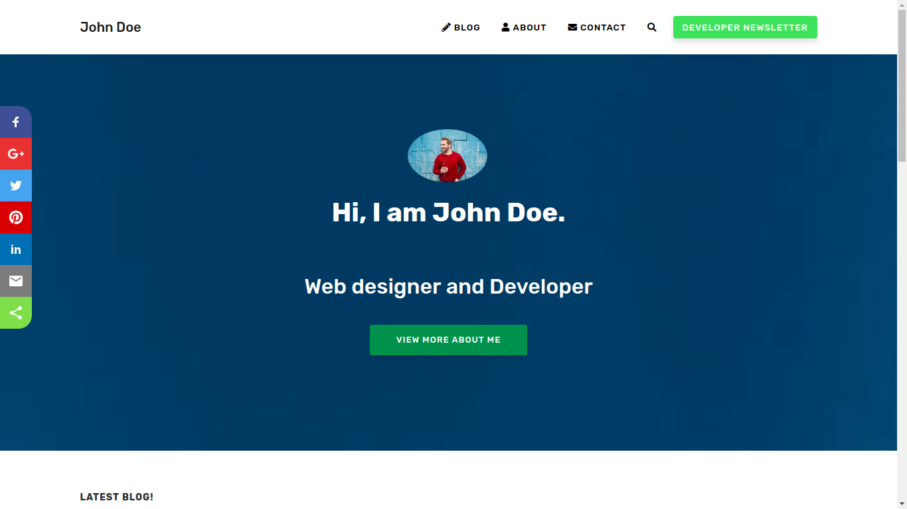

# Prasad 

> Prasad is a complete Jekyll theme designed for portfolio and blog for developers,  developed from forked version of Affiliate Jekyll theme.

- **Demo:** https://prasad.cdrrazan.com

>You can view the full live site using this theme <a href="https://cdrrazan.com" target="_blank">
>HERE.</a>  

>If you need any help open the issue in <a href="https://github.com/cdrrazan/prasad/issues/new"
>target="_blank"> here.</a>

Please refer to the [Theme setup in the demo site for full documentation of the theme.](https://prasad.cdrrazan.com/theme-setup)

## License

[MIT](LICENSE.txt)
